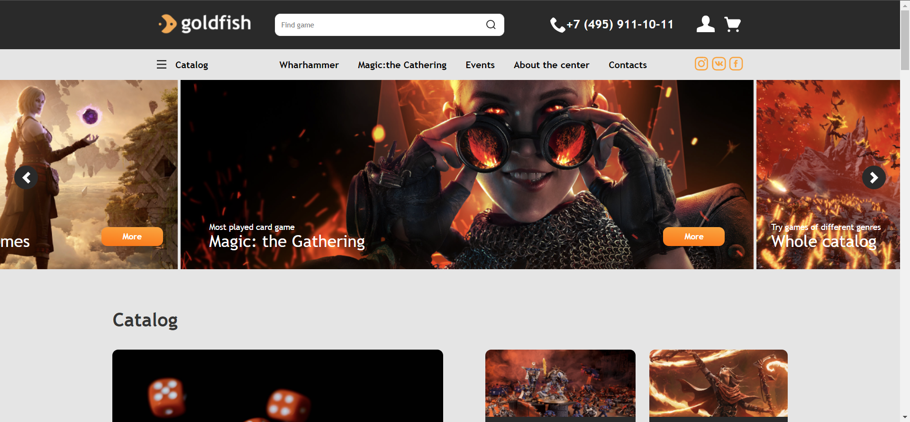
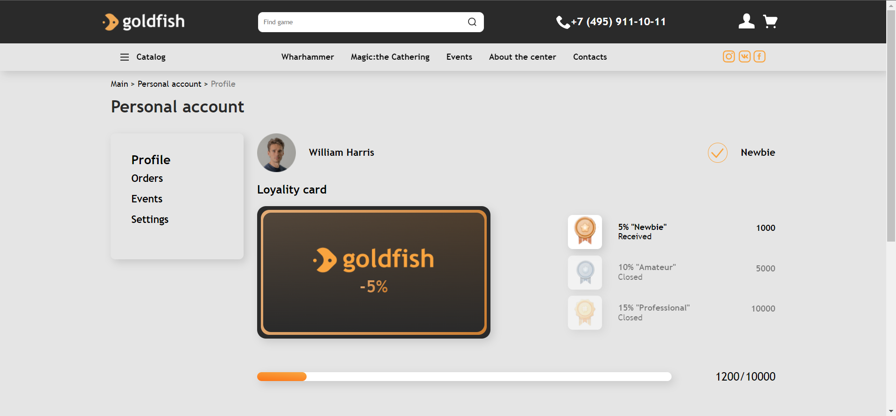

<div id="top"></div>


<!-- PROJECT LOGO -->
<br />
<div align="center">

<h3 align="center">Gold Fish</h3>

  <p align="center">
    <a href="https://freekson.github.io/GoldFish/">View Demo</a>
    ·
    <a href="https://github.com/Freekson/GoldFish/issues">Report Bug</a>

  </p>
</div>


<!-- TABLE OF CONTENTS -->
<details>
  <summary>Table of Contents</summary>
  <ol>
    <li>
      <a href="#about-the-project">About The Project</a>
    </li>   
    <li><a href="#installation">Installation</a></li>
    <li><a href="#contact">Contact</a></li>
  </ol>
</details>


<!-- ABOUT THE PROJECT -->
## About The Project

**Main page**



**Personal account**



The site of a large online store, with all the relevant features. The project will be created gradually, over a long period of time. Releases will appear at key points in the creation of the project.

**Starting from version v1.2, the project has been rewrite for Laravel**
 
<!-- GETTING STARTED -->

## Installation
_The way to install and get started has been changed_

1. Clone the repo
   ```sh
   git clone https://github.com/Freekson/GoldFish.git
   ```
2. Install NPM packages
   ```sh
   npm install laravel-mix@latest --save-dev 
   ```
3. Run server command
    ```sh
   php artisan serve
   ```
4. Other command

   > **npm run dev** - Run all Mix tasks.   
   >
   > **npm run production** - Run all Mix tasks and minify the output.  
   >
   > **npm run watch** - The npm run watch command will continue to run in the terminal and watch for any changes to your resources. When something changes, new files will be automatically compiled  
   >
   > **npm run watch-poll** - You may find that in certain environments Webpack doesn't update when your files change  


## Style and script directory structure:

>./resources/less/\*\*/\*.less   
>./public/js/\*\*/\*.js   
>./public/\*\*/\*.png/.jpg/.jpeg     

<!-- ROADMAP -->

See the [open issues](https://github.com/Freekson/GoldFish/issues) for a full list of proposed features (and known issues).
Check the [releases](https://github.com/Freekson/GoldFish/releases) to see completed items 


<!-- CONTACT -->
## Contact

Yehor Dreval 

- [instagram](https://www.instagram.com/freeksons)
- [telegram](https://t.me/freekson)

Project Link: [Gold Fish](https://github.com/Freekson/GoldFish)

<p align="right">(<a href="#top">back to top</a>)</p>