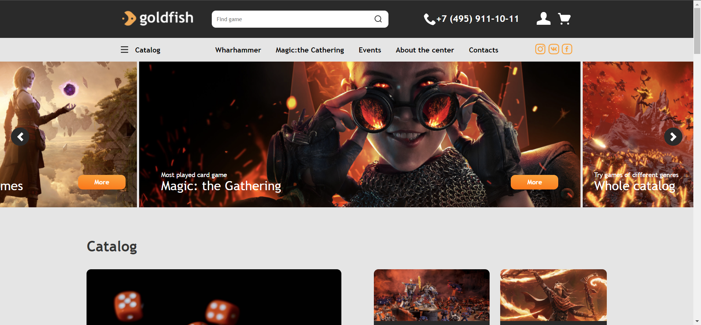

<div id="top"></div>


<!-- PROJECT LOGO -->
<br />
<div align="center">

<h3 align="center">Gold Fish</h3>

  <p align="center">
    <a href="https://freekson.github.io/GoldFish/">View Demo</a>
    ·
    <a href="https://github.com/Freekson/GoldFish/issues">Report Bug</a>

  </p>
</div>


<!-- TABLE OF CONTENTS -->
<details>
  <summary>Table of Contents</summary>
  <ol>
    <li>
      <a href="#about-the-project">About The Project</a>
    </li>   
    <li><a href="#installation">Installation</a></li>
    <li><a href="#roadmap">Roadmap</a></li>
    <li><a href="#license">License</a></li>
    <li><a href="#contact">Contact</a></li>
  </ol>
</details>


<!-- ABOUT THE PROJECT -->
## About The Project



The site of a large online store, with all the relevant features. The project will be created gradually, over a long period of time. Releases will appear at key points in the creation of the project.


<!-- GETTING STARTED -->

## Installation

1. Clone the repo
   ```sh
   git clone https://github.com/Freekson/GoldFish.git
   ```
2. Install NPM packages
   ```sh
   npm install
   ```
3. Run gulp command
    ```sh
   gulp
   ```
4. Other gulp command

   > gulp clean - dist directory   
    gulp styles - convert LESS to CSS, minify it and merge it into  one   file (main.min.css)    
    gulp scripts - convert JS to ES5 standard, minify and execute in   one file (main.min.js)  
    gulp img - image measurements size  
    gulp watch - launches automatic execution of styles and scripts   when they are changed  
    gulp build is a default job  


## Style and script directory structure:

>./src/styles/\*\*/\*.less   
>./src/scripts/\*\*/\*.js   
>./src/img/\*\*/\*.png/.jpg/.jpeg     


<!-- ROADMAP -->
## Roadmap

- [x] Create main page
  - [x] Add js to main page
- [ ] Create side pages
    - [ ] Product page
    - [x] Cart
    - [x] Forms
    - [ ] About us
    - [x] User page
    - [x] Orderinf
    - [ ] Event page
    - [x] Order
- [ ] Add adaptive to all pages
    - [ ] Product page
    - [x] Cart
    - [ ] Forms
    - [ ] About us
    - [ ] Blog 
    - [ ] Article
    - [ ] Event page
    - [x] Order


See the [open issues](https://github.com/Freekson/GoldFish/issues) for a full list of proposed features (and known issues).
Check the [releases](https://github.com/Freekson/GoldFish/releases) to see completed items 


<!-- CONTACT -->
## Contact

Yehor Dreval 

- [instagram](https://www.instagram.com/freeksons)
- [telegram](https://t.me/freekson)

Project Link: [Gold Fish](https://github.com/Freekson/GoldFish)

<p align="right">(<a href="#top">back to top</a>)</p>
